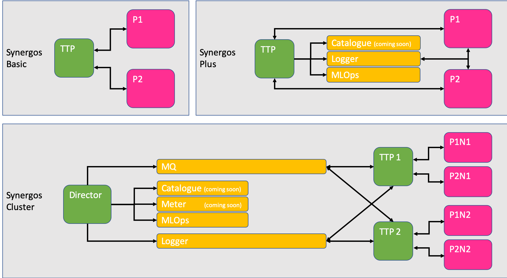

# Synergos Worker

Main federated receiver for a synergos cluster.



*Different grid configurations to suit your needs*

In federated learning, it is important to establish a secured grid, where all orchestrator(s) and participants can reside in, and communicate accordingly for complex federated workflows. However, this is often easier said than done, due to a multitude of deployment conditions & configurations to consider. That's where `Synergos` and its respective components come in. 

The ideas behind `Synergos` are simple: 
- MODULARITY - Plug-&-play methodology for assembling your ideal grid architecture
- AUTOMATION - All complexities involving federated orchestration are to be abstracted
- SIMPLICITY - Deploy & execute in a single command

TL;DR, We want users to be able to configure & deploy their federated endeavours with ease & confidence.

<br>

**Synergos Worker** is one of two core components essential for kickstarting your Synergos workflow!


*X-raying Synergos' core components*

Under the hood, we see that every feature embedded within each Synergos component is modularized as well. This allows users to activate or de-activate certain functionalities depending on their deployment setup.

Here's a quick breakdown of the various functions embedded within **Synergos Worker**:
- REST-RPC orchestration with [Synergos TTP](https://github.com/aimakerspace/synergos_ttp)
- Grid alignment of datasets
- Metrics generation
- Result management
- Centrialized logging
- Data cataloguing (coming soon!)

For a deeper dive into the various methodologies implemented, feel free to peruse our [guide](https://docs.synergos.ai)!

> Note: All **`PARTICIPANTS`** will deploy at least 1 **Synergos Worker** instance(s)

---
<br>

## Installation

Synergos Worker has been dockerized for easy component-based deployment. 

> Before continuing, please view our [guide](https://docs.synergos.ai/DatasetStructure.html) on how to organise your datasets before loading into Synergos Worker.

Once you have formatted your datasets properly, execute the following instructions:

```
# Download source repository
git clone https://github.com/aimakerspace/synergos_worker.git
cd ./synergos_worker

# Checkout to stable tag
git checkout tags/v0.1.0

# Initialize & update all submodules
git submodule update --init --recursive
git submodule update --recursive --remote

# Build director image
docker build -t synergos_worker:v0.1.0 --label "synworker" .

# Start containerized service
docker run --rm 
    -p <COMMAND PORT>:5000 
    -p <DATA PORT>:8020      
    -v <PATH-TO-DATASETS>:/worker/data      # <-- Mount for dataset access
    -v <PATH-TO-OUTPUTS>:/worker/outputs    # <-- Mount for outputs access
    --name <WORKER-ID> 
    synergos_worker:v0.1.0         
        --id <WORKER-ID>        
        --logging_variant <LOGGER-VARIANT> <LOGGER-HOST> <SYSMETRIC-PORT> 
        --logging_resolution <LOGGING-RESOLUTION>   # <-- optional
        --cpus <CPU-COUNT>                          # <-- optional
        --gpus <GPU-COUNT>                          # <-- optional
        --censored                                  # <-- optional
        --debug                                     # <-- optional
```
- `<WORKER_ID>` - ID of this worker instance. If not specified, a random UUID will be generated.
- `<COMMAND PORT>` - Port on which REST-RPC service resides
- `<DATA PORT>` - Port on which intra-network TTP-WORKER communication occurs on
- `<PATH-TO-DATASETS>` - User's custom volume on which datasets are stored 
- `<PATH-TO-OUTPUTS>` - User's custom volume on which outputs are to be stored
- `<LOGGER-VARIANT>` - Logger backend deployed (i.e. `"graylog"` or `"basic"`)
    - `<LOGGER-HOST>` - If Synergos Logger was deployed, specify logger's host
    - `<SYSMETRIC-PORT>` - If Synergos Logger was deployed, specify logger's allocated sysmetric port. A sysmetric port is the port allocated for logging system resource usage for any synergos component within the same deployment setting/grid.

Examples of a launch command are as follows:

```
# Basic logging (to screen)
docker run --rm 
    -p 5001:5000      
    -v /synergos_demos/party_1/data/:/worker/data      
    -v /synergos_demos/party_1/outputs/:/worker/outputs
    --name party_1_node_1
    synergos_director:syncluster          
        --id party_1_node_1        
        --logging_variant basic

# With centralized logging deployed by Orchestrator
docker run --rm 
    -p 5002:5000      
    -v /synergos_demos/party_1/data/:/worker/data      
    -v /synergos_demos/party_1/outputs/:/worker/outputs
    --name party_1_node_2
    synergos_director:syncluster          
        --id party_1_node_2        
        --logging_variant graylog 172.30.0.4 9300
```

> Note: There is no limit to how many **Synergos Worker** nodes a participant can deploy. However, only `N` nodes will be used, where `N` is the number of TTPs deployed by the orchestrator. We recommend that you discuss with your collaborators first on what the ideal `N` is :)

---
<br>

## Further Resources

You can view the guides for running:
- [Synergos Basic Standalone Grid i.e. local](https://docs.synergos.ai/BasicRunLocal.html)
- [Synergos Basic Distributed Grid i.e. across multiple devices](https://docs.synergos.ai/BasicRunDistributed.html)
- [Synergos Cluster Distributed Grid i.e. across multiple devices](https://docs.synergos.ai/ClusterRunDistributed.html)
- [Example Datasets and Jupyter Notebooks](https://github.com/aimakerspace/Synergos/tree/master/examples)
